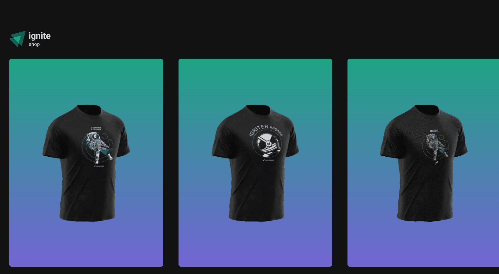
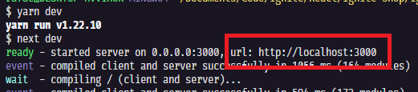

# Ignite Shop 🛒
Projeto realizado usando o framework Next.js, desenvolvido no módulo do curso Ignite na Rocketseat🚀. Nesse módulo foi criado um projeto completo para conhecer os fundamentos do framework Next.js, utilizando StitchesJS, passando por conceitos de SPA, Server-Side Rendering (SSR) e Static-Site Generation (SSG) e uso da API do Stripe para retorno de produtos e simulação do processo de compra real em um e-commerce.



## Tecnologias usadas ⚙
  - Next.js
  - React.js
  - Typescript
  - Stitches
  - Keen Slider
  - Stripe
  

## Ultima atualização 🔃
- Usando API Stripe para retorno de produtos;
- Sessão de checkout de produto com Stripe
- Página de compra finalizada.

## Como utilizar
- Clone o projeto do repositório
```
git clone https://github.com/RafaelMatos/igniteShop.git
```
- Acesse a pasta do projeto
```
cd igniteShop
```
- Instale as dependências 
```
yarn
```
<!-- - Execute o JSON Server
```
yarn dev:server
``` -->
- Execute o projeto
```
yarn dev
```

- Acesse no navegador o endereço indicado no terminal


